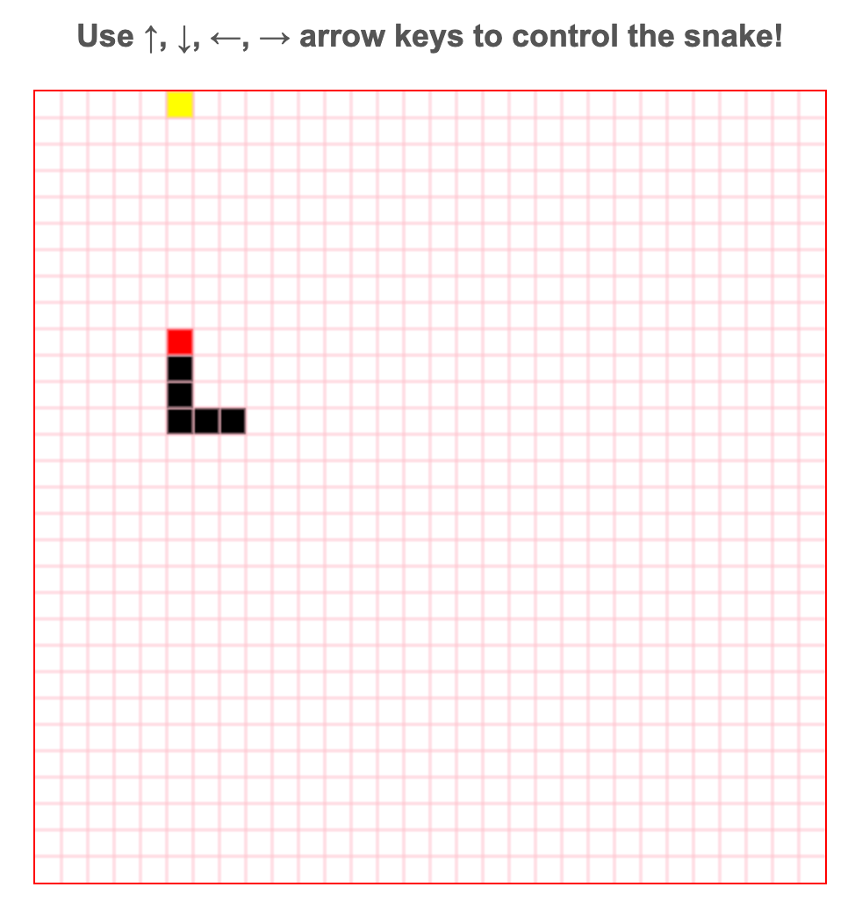

## 🐍 Greedy Snake

A lightweight browser-based Snake game built with **JavaScript** and the **HTML5 Canvas API**.

🔗 **Live Demo**: https://leo7805.github.io/greedy_snake

---

### 📷 Screenshot

  

---

### 📌 Overview

This project is a simple implementation of the classic Snake game, developed to practise fundamental front-end programming concepts including:

- Canvas-based rendering  
- Event-driven input handling  
- Real-time game loop logic  
- Collision detection  
- Basic state management  

The game runs entirely in the browser with no external libraries or frameworks.

---

### 🛠️ Tech Stack

- JavaScript (ES6)
- HTML5 Canvas API

---

### 🎮 Core Features

- 30 × 30 dynamic grid rendered using HTML5 Canvas  
- Keyboard-controlled snake movement (arrow keys)  
- Real-time automated movement via game loop (`setInterval`)  
- Food spawning at random valid positions  
- Collision detection (snake body & food)  
- Progressive snake growth upon food consumption  
- Score tracking system  

---

### ⚙️ Game Mechanics

- The game board consists of **30 × 30 cells**, each measuring **15px × 15px**  
  (Canvas size: **450px × 450px**)

- The snake is represented as an array of grid coordinates and consists of:
  - A directional head
  - A dynamically updated body

- Movement algorithm:
  1. Generate a new head based on the current direction  
  2. Remove the last segment (tail)  
  3. Append the new head to the snake body  

- When the snake consumes food:
  - A new segment is added to its body  
  - The score is incremented  
  - A new food item is randomly generated  

---

### 🚀 How to Run Locally

Simply open the `index.html` file in your browser.
